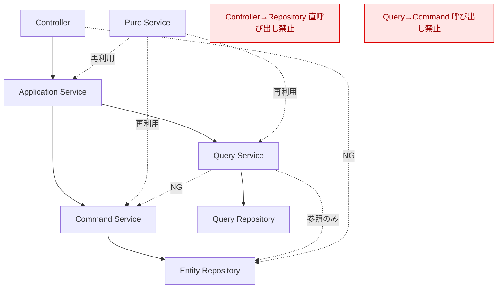

# アーキテクチャ設計方針

**文書目的**：変更時に「どこを直すか」を即断できる共通ルールを示す（説明よりも判断基準を優先）  
**採用方式**：トランザクションスクリプト方式  
**最優先目標**：ユースケース単位の変更を局所化する

---

## 1. 設計意図（Why）

- 業務ユースケース単位で処理を独立させ、**影響範囲を局所化**する  
- 複雑なドメインモデルを前提にせず、**手続きの見通し**を良くする  
- **変更判断の迷いを最小化**する（層ごとの責務と禁止事項を明確化）

---

## 2. レイヤ構成（What）

- **Controller**
- **Application Service**
- **Command Service**
- **Query Service**
- **Pure Service**
- **Repository**
  - Entity Repository
  - Query Repository

---

## 3. レイヤ別ルール（Do / Don’t）

### 3.1 Controller
**Do**
- リクエスト受信、基本バリデーション（型・必須・フォーマット）
- Application Service 呼び出し

**Don’t**
- 業務判断・状態遷移
- 永続化・クエリ実行

---

### 3.2 Application Service（ユースケースの流れ制御）
**Do**
- フロー制御、トランザクション境界の設定
- Command / Query の組み合わせ
- DTO・レスポンス生成

**Don’t**
- 詳細な業務ルール実装
- データ整合性チェックの実装

---

### 3.3 Command Service（書き込み系）
**Do**
- 登録・更新・削除（副作用の集中）
- 状態遷移・業務ルール・整合性チェック
- Entity Repository / Domain Service の呼び出し

**Don’t**
- 画面都合のデータ整形
- 検索・一覧取得ロジック
- **業務データを戻り値として返却しない**（副作用に限定）

---

### 3.4 Query Service（読み取り系）
**Do**
- 検索・取得・集計
- Query Repository の利用（必要に応じて Entity Repository 参照）

**Don’t**
- 更新・状態遷移
- 業務ルールの判断

---

### 3.5 Pure Service
**Do**
- 計算・判定などの**再利用可能な業務知識**
- ステートレス（状態を持たない）

**Don’t**
- 永続化
- UI都合の整形

---

### 3.6 Repository
#### Entity Repository（永続化）
- Do：エンティティの保存・取得・更新・削除
- Don’t：業務ルール実装、画面都合の集計

#### Query Repository（取得・集計）
- Do：検索・集計クエリ
- Don’t：更新・状態遷移

---

## 4. 層横断ルール（重要）

- Controller → Repository **直接呼び出し禁止**
- Query Service → Command Service **呼び出し禁止**
- **業務ルールは Controller / Repository に書かない**
- **状態遷移は Command Service のみ**
- 例外処理・トランザクション境界は **Application Service** に集約

---

## 5. 変更時のクイック判断（運用フロー）

1. **UI入力の正当性だけ？** → Controller  
2. **ユースケースの流れ変更？** → Application Service  
3. **状態が変わる／整合性を守る？** → Command Service  
4. **一覧・検索・集計の形を変える？** → Query Service  
5. **複数箇所で使う業務計算・判定？** → Pure Service  
6. **DBアクセス方法変更？** → Repository（Entity / Query を選択）

---

## 6. 保守向けチェックリスト（禁止事項）

- [ ] Controller から Repository を直接叩いていない  
- [ ] Query Service に状態遷移や更新がない  
- [ ] Command Service が画面都合の整形をしない  
- [ ] Repository に業務ルールが侵入していない  
- [ ] Domain Service が状態を持たない（ステートレス）  
- [ ] Command Service の戻り値が業務データになっていない  
- [ ] 例外・トランザクション境界が Application Service に集約されている

---

## 7. 呼び出し関係（Mermaid）

